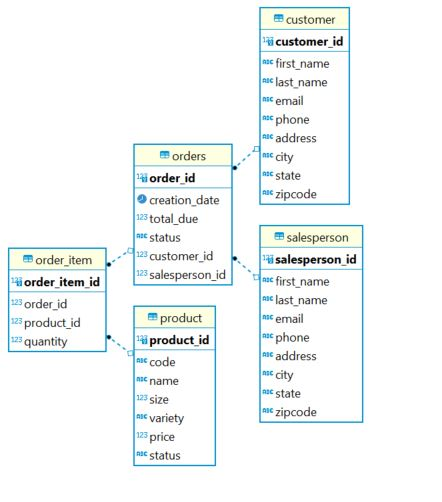

# JDBC

## Introduction

This app is a high level demonstration of JDBC and data access design patterns. 
This app implements a database which is manipulated using JDBC. The technologies used for this 
project include Docker, which is used to access an instance of PostgreSQL. The `psql` CLI tool and DBeaver  
are used to access the database. JDBC is used to access and update the database. Finally, 
Maven is used to build the project. 

This app was created in tandem with a JDBC course offered through Lynda.
https://www.linkedin.com/learning/learning-jdbc

# Implementation

## ER Diagram

ER Diagram for the database used. 

## Design Patterns
This app implements a Data Access Object (DAO) pattern for a Customer and Order object. The DAO pattern creates an abstraction layer 
between the application and the database. This allows for application users to do CRUD operations without exposing 
details of the database. Objects are transferred using Data Transfer Object (DTO) models, which efficiently transport 
an object to and from the database. 

Another data abstraction pattern is the repository pattern. This pattern handles only one specific type of object. 
The operations of a repository pattern handle objects more collections, for example a repository pattern will implement
remove, add, or contains operations. Repository patterns are not well suited to handle atomic transactions.

# Test
For this project a pre-populated test database called `hplussport` was provided. The SQL scripts to implement this database
was provided through the Lynda course. The `main` class in this project is the `JDBCExecutor.java` class which calls the methods in the `CustomerDAO.java` and 
`OrderDAO.java` classes. These methods update the database in some way. The results of these calls were confirmed by 
executing the underlying queries using the `psql` CLI or by using DBeaver to view the tables. 

