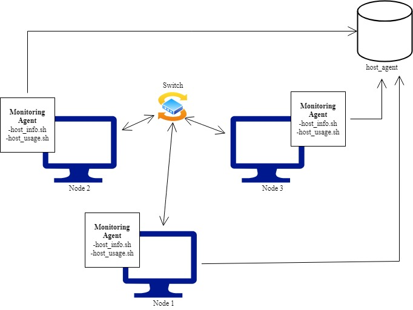

#Linux Cluster Monitoring Agent

##Introduction
The Linux Cluster Agent (LCA) is designed to monitor a cluster of internally connected nodes or servers. The monitoring agent gathers hardware specifications about the host node/server as well as its real time usage information. This data is used to allocate resources and for planning purposes. Users of this project include owners of the nodes or servers connected to the cluster, as well as the LCA team that will be collecting and analyzing the data.

This project uses a bash monitoring agent. The hardware and usage data is persisted through an instance of PostgreSQL (PSQL). An instance of PSQL is run on a docker container. Version control is tracked through git and the source code is hosted on GitHub. 

##Quick Start 

1. Provision a PSQL instance through a docker container using `psql_docker.sh`
```
./scripts/psql_docker.sh create [psql_username] [psql_password]
```
If the docker container already exists, start the PSQL instance.
```
./scripts/psql_docker.sh start
```
2. Create a database named `host_agent` if not already created.
```
psql -h [psql_host]-U [psql_user] -c "CREATE DATABASE host_agent"
```
3. Create tables in the `host_agent` database using `ddl.sql`.
```
psql -h [psql_host] -U [psql_user] -d host_agent -f ddl.sql
```
4.Insert the hardware specification data into the `host_info` table using `host_info.sh`.
```
./scripts/host_info.sh [psql_host] [psql_port] host_agent [psql_user] [psql_password]
```
5. Create a `crontab` job that collects hardware usage data and inserts to `host_usage` every minute. 
```
crontab -e

#add to crontab 
* * * * * bash $PATH/host_usage.sh [psql_host] [psql_port] host_agent [psql_user] [psql_password] > /tmp/host_usage.log
```
The hardware and usage data can be queried as needed using `queries.sql`.
```
psql -h [psql_host] -U [psql_user] -d host_agent -f queires.sql
```
##Implementation

###Architecture

As described in the LCA diagram above, each node has a monitoring agent installed to it. The monitoring agent consists of two fies, `host_info.sh` and `host_usage.sh` which are sending information to the `host_agent` database. 

###Scripts
* `psql_docker.sh`: Provisions, starts, or stops a PSQL instance using docker.
```
#usage
./scripts/psql_docker.sh start|stop|create [psql_user][psql_password]
```
* `ddl.sql`: Creates `host_info` and `host_usage` tables for `host_agent` database.
```
#usage
psql -h [psql_host] -U [psql_user] -d host_agent -f ddl.sql
```
* `host_info.sh`: Inserts hardware specifications into `host_info` table.
```
#usage
./host_info.sh [psql_host] [psql_port] host_agent [psql_user] [psql_password]
```
* `host_usage.sh`: Inserts hardware specifications into `host_usage` table.
```
#usage
./host_usage.sh [psql_host] [psql_port] host_agent [psql_user] [psql_password]
```
* `crontab`: Automates execution of `host_usage.sh` so that usage data is collected every minute. The output of the crontab job is saved to `/tmp/host_usage.log`. 
```
#usage
#edit crontab 
crontab -e 
#add the following job to crotab 
* * * * * bash $PATH/host_usage.sh [psql_host] [psql_port] host_agent [psql_user] [psql_password] > /tmp/host_usage.log
````
* `queries.sql`: Executes 3 queries on the hardware and usage data. The first query groups nodes by their CPU number and sorts by descending total memory within the group. The second query calculates the average memory used by each node over a 5 minute interval as a percentage. The last query detects any failures in the `crontab` job by returning any nodes that have less than inserts in `host_usage` over a 5 minute interval.
```
#usage
psql -h [psql_host] -U [psql_user] -d host_agent -f queires.sql
```
###Database Modeling
The database `host_agent` consists of two tables, `host_info` and `host_usage`.

`host_info` contains hardware specifications of each node or server. There is one entry for each node connected to the cluster as the hardware specifications of each node are assumed to stay constant throughout its connection to the cluster. The following information is stored in this table:
t
* `id`: Unique ID number assigned to each node. This serves as a *primary key* for the table. The ID is generated by PSQL through an auto-increment
* `hostname`: Full name of the node 
* `cpu_number`: Number of CPU's running on the node
* `cpu_architecture`: Architecture of the CPU
* `cpu_model`: CPU model name
* `cpu_mhz`: CPU frequency measured in MHz 
* `L2_cache`: Size of the L2 memory cache measured in KB 
* `total_mem`: Total memory size measured in KB
* `timestamp`: Time of data collection in UTC time zone 

`host_usage` contains real time usage data for each node. The usage information is collected every minute. The following information is stored in this table: 
* `timestamp`: Time of collection in UTC time zone
* `host_id`: This is a *foreign key* referencing `id` in the `host_info` table. It indicates which node the usage data is being collected from
* `memory_free`: The total free memory in MB
* `cpu_idle`: CPU resources idle given as a percentage
* `cpu_kernel`: CPU resources being used by the kernel in percentage
* `disk_io`: Number of disk I/O
* `disk_available`: Memory available to root directory in MB

#Testing
As this is an MVP product, testing was conducted only on a single node. 

* `psql_docker.sh`: Before any docker container was created, the following tests were run.
```
#Starting or stopping a container that does not exist 
./psql_docker.sh start
./psql_docker.sh stop 
#Both of these return "The container does not exist."

#create a container running the psql image
./psql_docker.sh create "postgres" "password"
#No errors. Creates docker container running a PSQL instance

#create a container that already exists
./psql_docker.sh create "postgres" "password"
#Returns "Container already exists"

#check that the container is running
docker ps -f name=jrvs-psql 
#Returns jrvs-psql entry in table of running containers

#stop a running container 
./psql_docker.sh stop
docker ps -f name=jrvs-psql 
#No errors. Container is no longer listed in table of running containers

#start a stopped container 
./psql_docker.sh start 
docker ps -f name=jrvs-psql 
#No errors. Container is listed in table of running containers. 

#Running an illegal command. 
./psql_docker xxxx
#Returns "Illegal command"
```
* ddl.sql: Prior to any tables being added to the database `host_agent`, the following tests were run.
```
#Create tables for database 
psql -h localhost -U postgres -d host_agent -f ddl.sql
psql -h localhost -U postgres -d host_agent -c "\dt public.*"
#Results in `host_info` and `host_usage` tables added to the database

#Create tables for database when `host_info` and `host_usage` already exist
psql -h localhost -U postgres -d host_agent -f ddl.sql
#Results in notification that PSQL skipped CREATE TABLE commands
``` 
* `host_info.sh`: The following tests were run.
```
#Insert hardware specification data
./host_info.sh "localhost" 5432 host_agent "postgres" "password"
#Results in new entry in `host_info.sh`
```
* `host_usage.sh`: The following tests were run.
```
#Insert hardware usage data
./host_usage.sh "localhost" 5432 host_agent "postgres" "password"
#Results in new entry in `host_usage.sh`
```
* `crontab`: The following tests were run.
```
#check that crontab job is running 
cat /tmp/host_usage.log
#Results in "INSERT 0 1" if insert is successful. Error message if insert is not successful. 
```
* `queries.sql`: The following tests were run.
```
#run the queries
psql -h localhost -U postgres -d host_agent -f queries.sql
#Results in three tables. Table 1 has groupings of nodes by cpu_number and in order of descending total memory. Table 2 has average memory usage percentage over a five minute interval for each node. Table 3 lists nodes and timestamps where crontab failed. 
```
##Deployment 
To deploy this project, a docker container running the PSQL instance must be created on each node. `host_info.sh` only needs to be run once when the node is added to the LCA. `host_usage.sh` is executed using a `crontab` job running every minute. The source code and all versions is released through GitHub. 

##Improvements 
* This project currently handle hardware updates. As `host_info.sh` is only run once, any updates to the host's hardware are not updated by the monitoring agent. 
* The query searching for instances of `crontab` failure does not detect cases where the `crontab` job did 0 inserts for a node over a 5 minute interval into the `host_usage`. 
* There are no limits on the amount of usage data collected. This could quickly lead to performance and memory issues. A possible solution might be implementing some clean-up or archiving of historical data. 